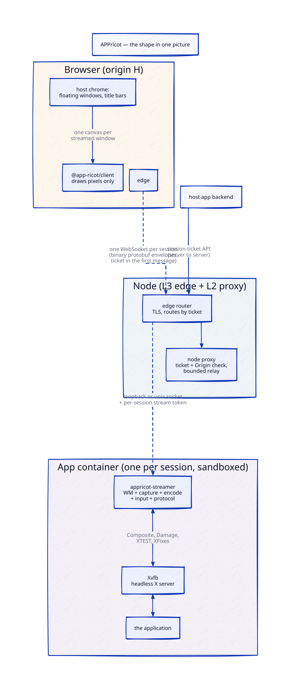
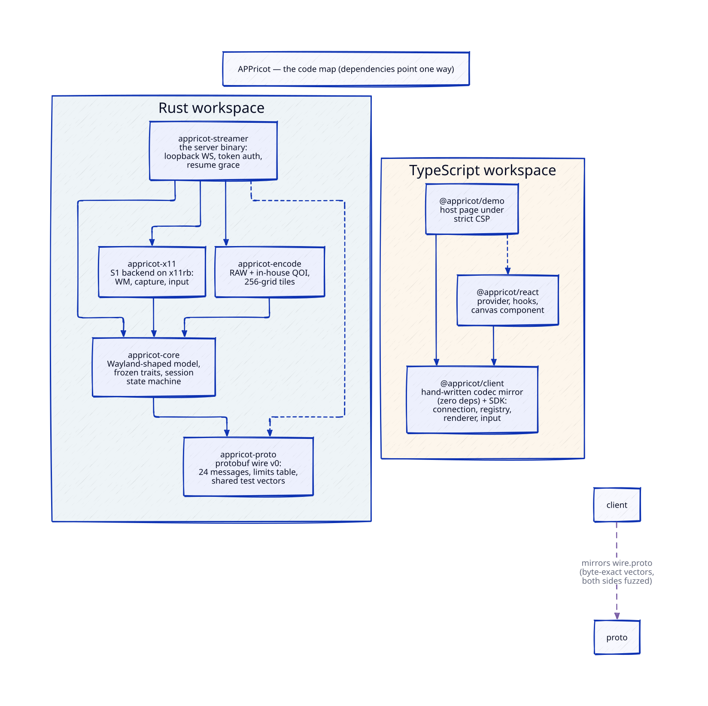

# APPricot


APPricot is a sandboxed, preconfigured application streamer. It runs a desktop application inside
its own container, next to a headless display server, and streams **each of that application's
windows** into a host web UI, where every streamed window becomes one of the host UI's own floating
windows. The host draws the chrome — the title bar, the frame, the taskbar entry — and APPricot
fills the content. It is not a remote-desktop canvas, and the browser client is a library the host
embeds, not a page a user visits. The design treats the streamer as untrusted, because it shares
the streamed application's sandbox: the client renders every server string as text, never as
markup, script or navigation
([ADR-0003](docs/adr/0003-untrusted-server-client.md), Proposed).

**Rust server, TypeScript client. Dual-licensed under MIT OR Apache-2.0**
([LICENSE-MIT](LICENSE-MIT), [LICENSE-APACHE](LICENSE-APACHE)).

## The shape of it



One sandboxed container per application, a streamer beside a headless display server, a host page
whose own windows carry the content. What is built and gated today, on the L1 streamer layer:

- **Wire protocol v0.** Protocol Buffers (proto3) over binary WebSocket frames. Every length,
  count and dimension is bounded by a limits table, and the decoder checks a limit before it
  allocates. The Rust and TypeScript codecs pass the same generated test vectors, and both
  decoders run under fuzz tests.
- **The X11 backend, and the window manager.** One crate does both: Composite redirect and
  per-window Damage for capture, XTEST for input, XFixes for the cursor — plus the minimal
  window-manager duties, mapping override-redirect windows to popups and `WM_TRANSIENT_FOR` to
  parent links, with untrusted sizes and stacking clamped.
- **Lossless tiles.** Captured damage is cut into tiles and encoded RAW or with an in-house QOI
  encoder. Lossless first; the codec set is a decision the measurements still own.
- **Ack-driven flow control.** Frames carry a per-surface sequence number; the client acks what it
  has drawn, and the server keeps a small fixed number of frames in flight per surface and
  coalesces damage while it waits. Nothing is sent on a timer; an idle window sends nothing.
- **Resume.** A dropped transport is not a dead session. The client reattaches with its token and
  the server re-sends the window set and a full frame per surface, instead of replaying damage the
  client may have missed.
- **An embeddable browser client.** `@appricot/client` is framework-agnostic TypeScript —
  connection, the codec mirror, a window registry with events, tile decode, input and key mapping,
  text clipboard in both directions as the host's policy allows — drawing into canvases the host
  provides. `@appricot/react` adds a provider, hooks and a window canvas. The client never turns a
  server string into markup: that rule is enforced by lint rules that fail the build and proven in
  CI against a hostile test server.
- **A demo host page.** Floating windows with drag, resize, minimise, close and focus; popups
  placed and clamped to their parent; the streamed cursor — served under a strict CSP with no
  `'unsafe-inline'` and no `'unsafe-eval'` in `script-src`.

The first host application — the web product that will embed the client — is private and lives in
its own repository; it is not named here. The pilot application APPricot streams first is an X11
client built on Qt6/xcb.

## Quick start

Everything runs in Docker through compose. Never run `cargo`, `pnpm`, `node` or `just` on the host.
The compose project name is `appricot`, and no host port is published except the demo's
loopback-only one below.

```sh
docker compose build dev                    # build the dev image (appricot-dev:local)
docker compose run --rm dev just check      # THE gate: everything, in order
docker compose run --rm -p "127.0.0.1:${APPRICOT_DEMO_HOST_PORT:-8390}:8390" dev just demo
```

`just check` runs `fmt-check clippy test doc deny` for the Rust workspace, then
`web-install web-build web-typecheck web-lint web-test` for the TypeScript packages — inside the
container. `just deny` clones the RustSec advisory database, so the gate needs network access.

The demo recipe builds the web packages, starts the streamer on loopback inside the container and
serves the demo host page on port 8390 (published loopback-only through `APPRICOT_DEMO_HOST_PORT`;
the demo's server proxies the streamer's WebSocket, so the streamer keeps its loopback-only bind).
Open **http://127.0.0.1:8390** and paste the token the recipe prints — the default is
`demo-token`; override it with `APPRICOT_DEMO_TOKEN`. Ctrl-C stops both processes.

Useful variants:

```sh
docker compose run --rm dev just            # list every recipe
docker compose run --rm dev bash            # a shell, with the headless X server already up
```

`scripts/dev.sh <cmd...>` (Git Bash) and `scripts/dev.ps1 <cmd...>` (PowerShell) are thin wrappers
around `docker compose run --rm dev <cmd...>`. They do not build the image, they return the
command's own exit code, and with no arguments they list the recipes.

`Cargo.lock` and `pnpm-lock.yaml` belong to the repository, so a clean clone needs no resolution
step: every recipe builds `--locked` / `--frozen-lockfile` and fails loudly on a stale lockfile
instead of rewriting it.

## The code map



| Crate / package | What it is |
|---|---|
| [`crates/appricot-proto`](crates/appricot-proto) | Wire protocol v0: protobuf messages, the limits table and a bounded codec. No I/O. |
| [`crates/appricot-core`](crates/appricot-core) | The backend-agnostic, Wayland-shaped window model; the `CaptureBackend` and `InputSink` traits; damage and ack-driven frame scheduling. Names no X11 or Wayland type. |
| [`crates/appricot-x11`](crates/appricot-x11) | The S1 capture backend on x11rb: Composite redirect, Damage, XFixes, XTEST — and the minimal window manager. |
| [`crates/appricot-encode`](crates/appricot-encode) | Tile encoders: RAW and an in-house QOI, plus tile cutting. Lossless first. |
| [`crates/appricot-streamer`](crates/appricot-streamer) | The binary that runs inside the app container: the protocol over a loopback WebSocket or a unix socket, per-session token auth, a readiness endpoint. |
| [`packages/client`](packages/client) | `@appricot/client`: the framework-agnostic TypeScript client — connection, codec mirror, window registry, tile decode, input and key mapping. Draws into canvases the host provides. |
| [`packages/react`](packages/react) | `@appricot/react`: React bindings — a provider, hooks and a window canvas. The host renders its own chrome. |
| [`packages/demo`](packages/demo) | `@appricot/demo`: the demo host page and its static server with the WebSocket proxy. Dev-only; never shipped. |

Dependencies point one way and review enforces it: `proto ← core ← x11`, `encode → core`, and
`streamer` may depend on all of them. `proto` depends on no sibling; `core` depends on `proto`
only.

## Repository layout

```
crates/            the Rust workspace
  appricot-proto/    wire protocol v0: protobuf types and the bounded codec, no I/O
  appricot-core/     the backend-agnostic window model (Wayland-shaped), capture and
                     input traits, damage and frame pacing
  appricot-x11/      the X11 backend on x11rb: Composite, Damage, XTEST, XFixes,
                     and the minimal window-manager duties
  appricot-encode/   tile encoders: RAW and an in-house QOI, tile cutting
  appricot-streamer/ the binary that runs inside the app container
packages/          the TypeScript workspace
  client/            @appricot/client: framework-agnostic browser client
  react/             @appricot/react: React bindings (provider, hooks, window canvas)
  demo/              @appricot/demo: the demo host page, dev-only
docker/dev/        the dev image every gate runs in
docs/              vision, architecture, roadmap, glossary, protocol, ADRs,
                   threat model, prior art, diagrams
assets/branding/   the mark, logos, icons and banners
scripts/           dev.sh and dev.ps1: run a command in the dev container
AGENTS.md          the contract: what APPricot is, the gates, the rules a change must not break
justfile           the recipes the gate runs, inside the container
compose.yml        the dev container; the port scheme lives in its header comment
deny.toml          the Rust licence, advisory, ban and source gate
LICENSE-MIT        the MIT licence
LICENSE-APACHE     the Apache-2.0 licence
```

## Documents

- [docs/vision.md](docs/vision.md) — the problem, who it is for, what it is not, the principles.
- [docs/architecture.md](docs/architecture.md) — components per layer, the data path, trust
  boundaries, the window model, the backend matrix.
- [docs/protocol/README.md](docs/protocol/README.md) — the wire protocol and its design rules;
  the v0 message set is specified in [docs/protocol/v0.md](docs/protocol/v0.md), with
  `wire.proto` normative.
- [docs/roadmap.md](docs/roadmap.md) — milestones M0-M6 and their exit criteria.
- [docs/adr/README.md](docs/adr/README.md) — the decision records.
- [docs/security/threat-model.md](docs/security/threat-model.md) — assets, adversaries, controls.
- [docs/glossary.md](docs/glossary.md) — the words this project uses.
- [docs/prior-art.md](docs/prior-art.md) — related projects and what APPricot takes from them.
- [docs/diagrams/](docs/diagrams) — the sketch diagrams:
  [shape](docs/diagrams/shape.svg), [data path](docs/diagrams/data-path.svg) and
  [code map](docs/diagrams/code-map.svg).
- [AGENTS.md](AGENTS.md) — the contract for any agent working here: how to run every gate, and
  the rules a change must not break.

## Where it stands

| Layer | What it is | State |
|---|---|---|
| **L1 streamer** | The wire protocol, `appricot-streamer` (per-window capture and input, inside the app container next to a headless display server), and the embeddable browser client. | implemented; the spike's measurements are still open |
| **L2 node** | Single-node session manager: app profiles, a container per session, warm pool, readiness gate, reaper, per-session egress scoping, audit, session-ticket API. | documented, not scaffolded |
| **L3 broker** | Multi-node placement and session-affine routing. A ticket names the owning node; a stateful stream cannot migrate. | documented, not scaffolded |

**Done and gated.** The whole L1 stack — five Rust crates, three TypeScript packages — sits behind
`docker compose run --rm dev just check`. The M2 rows that CI proves: token auth and a readiness
endpoint on the streamer; ack-based flow control with idle windows sending nothing; resume after a
dropped transport; popups placed and clamped to their parent; titles as text; cursor, resize,
minimise, close and focus; the clipboard in both directions as the host's policy allows; the demo
page under a strict CSP; the hostile-server fixture; decoder fuzz tests on both sides of the wire.

**Still open.**

- The X11 capture spike's measurements: the numbers that v0's limits and the backend decision
  still rest on have yet to be taken, so v0's numbers may still move
  ([roadmap M1](docs/roadmap.md),
  [ADR-0004](docs/adr/0004-layers-window-model-and-first-backend.md)).
- The on-device browser matrix: input on desktop Chrome, Firefox and Safari, with US and Greek
  layouts, AltGr and dead keys.
- L2 and L3 are written down
  ([architecture](docs/architecture.md), [roadmap](docs/roadmap.md)) and deliberately not
  scaffolded: write them down first.
- The npm licence gate covers the production graph only. Whether devDependencies are gated too
  is open; ADR-0002 would need an amendment first.

## Licence

APPricot is dual-licensed under either of

- the MIT licence ([LICENSE-MIT](LICENSE-MIT)), or
- the Apache Licence, Version 2.0 ([LICENSE-APACHE](LICENSE-APACHE)),

at your option. This is the Rust ecosystem's convention, and it keeps the client embeddable in a
host product on either licence. Decided 2026-09-20; see
[ADR-0002](docs/adr/0002-licence.md). Every linked Rust dependency stays on the permissive allow
list of ADR-0002 §2, and `cargo deny` is the gate.

Unless you state otherwise, any contribution you intentionally submit for inclusion in this work,
as defined in the Apache-2.0 licence, is dual-licensed as above, with no additional terms or
conditions.

Author: George Gougoudis <george_gougoudis@hotmail.com>
