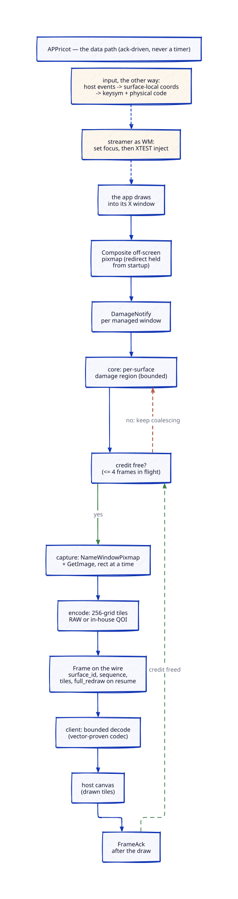

# Architecture

**Status: as-built for L1** (refreshed 2026-09-21). Layer 1 — the wire protocol, the five Rust
crates, the streamer binary and the TypeScript client — is implemented and its gates pass. The
X11 capture spike has not run: every measurement the spike owns is still open, and each such
place says so. L2 and L3 remain described here only, so that L1 does not paint them into a
corner. Anything marked "open" is decided in the task named next to it (see
[roadmap.md](roadmap.md)).

The three layers, the Wayland-shaped window model and the backend order come from
[ADR-0004](adr/0004-layers-window-model-and-first-backend.md); the client's rules for server
data come from [ADR-0003](adr/0003-untrusted-server-client.md). Both are still Proposed, not
accepted: the landed code follows them, and the user has not adopted them as decisions. The
licence is decided: APPricot is **MIT OR Apache-2.0**
([ADR-0002](adr/0002-licence.md)), and the permissive-only rule for dependencies comes with it.
If the user amends an ADR, this document follows it.

**Where the numbers come from.** Every measured figure below is from **an internal benchmark
(September 2026)**: the pilot application — a Qt6/xcb X11 desktop application — running under
Docker with no GPU, on Debian 12 and Debian 13, in two passes, one over X11 display stacks
(Xvfb, remote X11, xpra, an incumbent VNC image) and one over Wayland ones (weston, sway,
Xwayland). The first host application, the private product that will embed APPricot first, lives
in its own repository; APPricot depends on nothing inside it and this document cites nothing from
it. A claim with no measurement behind it says so.

## 1. The shape in one picture


*The shape in one picture: the host app backend hands the browser a ticket, the host page draws
its own chrome around one canvas per streamed window, and the app container holds Xvfb, the
application and `appricot-streamer` behind a loopback or unix socket with a per-session stream
token. The edge router and node proxy are planned (L2/L3); everything else in the picture is
built.*

In the container, the streamer's real shape: `appricot-streamer` is a single **axum** server
bound to `loopback:<port>` (an ephemeral port by default) or a `unix:<path>` socket — every
other address form is refused loudly. It exposes two routes: `GET /readyz`, which answers
`200 ready` only once the backend has connected and probed its display (before that, `503
starting`), and `GET /session`, the binary-only WebSocket. It serves **one session per
process**: a second upgrade while a session is live is refused over HTTP, a clean `Bye` ends
the slot forever, and a socket that drops without one parks the session for the resume grace
(10 s, [protocol/v0.md §7](protocol/v0.md#7-reattachment)) — a reconnect with the right
`resume_serial` gets the whole window set back plus one full redraw per surface, and at grace
expiry the backend is torn down.

The host app owns the page, the chrome and the user's identity. APPricot owns the stream. The
app inside the container owns nothing outside its own windows.

## 2. Components per layer

### 2.1 L1 streamer (implemented)

| Component | Kind | Job | Must not |
|---|---|---|---|
| `crates/appricot-proto` | Rust library | Wire protocol v0: all 24 messages, generated by prost from `wire.proto`, with encode, decode and validation; the limits table (24 caps); the shared test vectors both codecs must reproduce. Pure: no I/O, no async runtime. | Allocate from a length it has not checked against a limit. |
| `crates/appricot-core` | Rust library | The window model ([§4](#4-the-window-model)): surfaces, roles, positioners, scale, configure/ack. The frozen `CaptureBackend` and `InputSink` traits. The session state machine: bounded per-surface damage accumulation, frame scheduling driven by client acks (credits, never a timer), detach and resume (the grace clock is the streamer's). | Name an X11 or Wayland type. |
| `crates/appricot-x11` | Rust library | The S1 backend on x11rb — and the window manager: there is no other WM in the container. Composite manual redirect held from `connect()` for the connection's life, Damage, pixel grab from the named window pixmap (`GetImage`), XTEST input, XFixes cursor and selections, the keymap. Toplevels are placed to overlap as little as the root allows; nothing relies on it ([§4.2](#42-how-x11-maps-into-the-model)). | Trust anything an X client says about stacking, focus or size without clamping it. |
| `crates/appricot-encode` | Rust library | Tile encoders: RAW and QOI, both written in-house from the published specification — no third-party codec code in the graph ([ADR-0002](adr/0002-licence.md)). Tiles are cut on a 256-pixel grid aligned to the surface origin (`TILE_SIZE` = 256; a tile never crosses a grid line); the streamer keeps a frame to at most 48. QOI falls back to RAW whenever its stream would be longer than the RAW payload, and every tile draws opaque either way. | Pull a crate off the permissive allow list into the graph ([ADR-0002](adr/0002-licence.md)). |
| `crates/appricot-streamer` | Rust library + binary | The binary that runs inside the app container, in the shape [§1](#1-the-shape-in-one-picture) describes: axum, loopback/unix bind, token auth (byte compare with no early exit), readiness, the resume grace and its keeper, the backend actor on its own OS thread. | Listen on a non-loopback address. Accept a stream without the token. |
| `packages/client` (`@appricot/client`) | TypeScript, no framework, zero runtime dependencies | Connection and reconnect, the hand-written codec mirror (pinned byte-exact by the Rust-generated test vectors), a window registry with events, tile decode into `ImageData`, input capture and key mapping, clipboard hand-off under host policy. Draws into canvases the host provides. | Touch the DOM outside those canvases. Turn a server string into markup, script or a URL ([ADR-0003](adr/0003-untrusted-server-client.md)). |
| `packages/react` (`@appricot/react`) | TypeScript, React | Provider, hooks over the registry, a window-canvas component. The host renders its own chrome around it. | Render chrome. |
| `packages/demo` (`@appricot/demo`) | TypeScript, React | The demo host page and its static server: serves the page under a strict CSP and reverse-proxies `/session` and `/readyz` to the streamer's loopback bind, so the streamer is never published. Dev-only; never in a shipped dependency graph. | Shipping in anyone's dependency graph. |

Crate dependencies point one way: `proto` <- `core` <- `x11`, `encode` -> `core`, and
`appricot-streamer` may depend on all of them. Nothing points back: neither `appricot-proto`
nor `appricot-core` depends on a backend or on an encoder, and `appricot-proto` depends on no
sibling at all. The edges as built are `core` -> `proto`, `x11` -> `core`, `encode` -> `core`
and `streamer` -> `proto`/`core`/`x11`/`encode`. What `core` reuses from `proto` is the bounded
string types (`Title`, `AppId`) and the limits table's caps, re-exported so that each number has
one home; the rest of the model is its own, and the streamer maps
between model events and wire messages. The TypeScript client mirrors `wire.proto` by hand —
zero runtime dependencies, held byte-exact by the shared test vectors — and depends on no Rust
code at run time.


*The code map: every crate and package, what each owns, and the one-way edges between them.*

**Open (l1-spike-x11-capture):** who starts Xvfb and the app, and who ends the container when the
app's last process exits. In the pilot deployment a small in-image supervisor does this. Here it
may become a streamer mode or a sibling binary. (The dev container's entrypoint starts Xvfb for
the integration tests; that is a development convenience, not this decision.)

### 2.2 L2 node (documented, not scaffolded)

One node daemon per machine. Most of its parts have been built once already, in the pilot
deployment, for one application only
([§7](#7-what-the-pilot-deployment-already-proved)). The ticket API and profiles-as-data are new:

- **App profiles.** Image, launch command, environment, mounts, resource caps, egress policy,
  clipboard policy, scale policy. A profile is data, versioned, and read at session create.
- **Container orchestrator.** One container per session, through the Docker Engine API behind a
  socket proxy. The app container never sees the Docker socket.
- **Warm pool.** Pre-started containers per profile, so a press only activates one. The pilot
  deployment measured 0.77 s activations.
- **Readiness gate.** A session is handed out only when its own streamer owns its own listener.
  The gate re-knocks at claim time and on every reaper pass.
- **Reaper.** Idle measured on user input only, a hard TTL, and "container gone".
- **Egress scoper.** Per-session rules armed **at create, deny-all**, then widened to the
  profile's allow-list at activation. (The pilot deployment arms at activation; a warm session
  sitting with no rules at all is the gap that closes.)
- **Audit.** Session open (allowed or refused) and close (reason, duration). Nothing inside the
  session is recorded.
- **Session-ticket API.** The host app's backend asks for a session for (tenant, user, profile)
  and gets back a short-lived ticket. The browser presents the ticket; it never sees the stream
  token.
- **Node proxy.** Checks the ticket and the browser `Origin`, maps the ticket to the session,
  opens the loopback leg with the stream token, and relays frames with bounded buffers in both
  directions.

### 2.3 L3 broker (documented, not scaffolded)

- **Placement.** Picks a node for a new session by capacity and profile availability (warm
  sessions).
- **Tickets that name the node.** A ticket is signed and carries the owning node. A stream is
  stateful (an X server, an app, its windows), so it cannot move. Reconnects go to the same node.
- **Edge router.** Terminates TLS and routes each WebSocket to the node the ticket names. It does
  not parse frames.
- **Node health.** A dead node's sessions end. They are not migrated.

## 3. The data path

**Why the path is shaped this way.** Forwarding a display protocol raw does not survive a WAN.
The internal benchmark measured what an idle caret and a single keystroke cost over remote X11,
and what happens to the application when the link drops; the figures are in
[vision.md §3](vision.md#3-forward-the-display-protocol-itself) and are not repeated here. Three
rules follow from them, and the rest of this section is their implementation:

1. **Damage-driven, encoded, per-window frames.** What travels is the changed rectangles of one
   surface, encoded — never a whole window per repaint.
2. **Flow control.** Frames are paced by the client's acks, not by a timer, so a slow link makes
   the server coalesce instead of queue.
3. **A reconnect must not cost the session.** The application's lifetime belongs to its container,
   not to the transport. A browser that drops reconnects to the same session, on the same node.



*The data path, end to end: damage to tiles to Frame to host canvas to FrameAck — ack-driven,
never a timer; input flows the other way.*

### 3.1 Pixels: app to host canvas

1. The app draws into its X window.
2. Composite keeps that window's pixels in an off-screen pixmap. The redirect must be held from
   before the app starts: in the benchmark, a redirect made at grab time returned stale pixels.
   The backend holds `CompositeRedirectSubwindows(root, Manual)` for its connection's whole
   life.
3. The Damage extension reports changed rectangles. `appricot-core` adds them to that surface's
   dirty region.
4. The scheduler checks the surface's credits (frames sent but not yet acked;
   `MAX_FRAME_CREDITS` = 4). With a credit free, it takes the dirty region. Without one, it
   keeps coalescing. Nothing runs on a timer, so an idle window costs nothing.
5. The backend reads the dirty rectangles from the named window pixmap (`GetImage`, rectangle
   by rectangle). The benchmark confirmed this works while the window is covered by another
   window.
6. `appricot-encode` cuts the taken region into tiles on the 256-pixel grid aligned to the
   surface origin and encodes each tile as QOI. It falls back to RAW when the QOI stream would
   be longer than the RAW payload; a tie keeps QOI. The QOI encoder stops as soon as its stream
   passes that length. Every tile draws opaque, so the choice never shows
   ([protocol/v0.md §11](protocol/v0.md#11-tile-codecs)). The streamer, not the encoder, keeps a
   frame to at most `MAX_TILES_PER_FRAME` (48) tiles. The frame carries surface id, sequence
   number, rectangles, per-tile codec and payload, and the `full_redraw` flag.
7. The streamer sends it as one binary WebSocket message. The node proxy and the edge (planned,
   L2/L3) relay it without parsing, under a size cap.
8. The client checks the message against the limits table, decodes the tiles into `ImageData`
   and draws them into the canvas the host attached for that surface (a scratch canvas carries
   tiles through `drawImage` when the surface is scaled), then acks the sequence number. The
   ack means drawn, not received.

### 3.2 Input: host canvas to app

1. The host attaches a canvas; the client listens for pointer, wheel, key, composition, paste and
   blur events on it (or on a focus proxy it owns inside it).
2. Pointer coordinates become **surface-local**. Keys become a keysym plus the physical `code`:
   keysym first, with the code used for keys that carry no character and for shortcuts.
3. The client sends input only for the surface the host says is focused.
4. The streamer maps it to X. Two facts measured in the benchmark shape this: XTEST keys reach a
   covered window only after the streamer sets X focus on it, and an XTEST click lands on
   whichever window is on top at that point. So the streamer, as window manager, sets focus and
   raises the target before it injects pointer events. The S1 backend places toplevels to
   overlap as little as the root allows ([§4.2](#42-how-x11-maps-into-the-model)), but on the
   configured root they do overlap from the second realistic window on, so clicks reach the right
   window because of the raise, not because of the layout.
5. On blur, the client releases every held key and button.

### 3.3 Window lifecycle

1. The app maps a window. The backend classifies it ([§4.2](#42-how-x11-maps-into-the-model)) and
   the streamer sends `surface_new` with its role, parent and hints.
2. The client registry emits a "window added" event. The host creates its own floating window and
   hands the client a canvas for it.
3. The host sends a **configure** (serial, size). The streamer applies it to the X window.
   When the app has taken the new size, the streamer sends **ack_configure** with the serial and
   the size the app really took (it may clamp to its minimum). The host sizes its chrome to that.
   A size the app takes on its own arrives the same way, under serial 0.
4. Title, app id and icon changes arrive as metadata. The client exposes them as plain data.
5. Close from the host is a request (`WM_DELETE_WINDOW` in X11). The app decides. When its last
   process exits, the session ends.

## 4. The window model

The model is shaped after Wayland's xdg-shell, whatever the backend is; the decision is
[ADR-0004](adr/0004-layers-window-model-and-first-backend.md) (Proposed, and followed by the
landed code). The reasons are in the ADR. In short: Wayland already names the right concepts
(surfaces with roles, damage per surface, popups placed relative to a parent, per-surface
scale, explicit configure and ack), and a later Wayland backend should need no change
to the wire or the client.

### 4.1 Concepts

| Concept | Meaning here | Wayland reference |
|---|---|---|
| **Surface** | A rectangle of pixels with its own id, size, scale and damage. Every streamed window is a surface. | `wl_surface`: `damage_buffer` marks changed parts; a surface gets a role ([wayland.app/protocols/wayland](https://wayland.app/protocols/wayland)) |
| **Role** | What a surface is for: `toplevel` or `popup`. Set once, never changed. | A `wl_surface` "has another role" error if a second role is given (same page) |
| **Toplevel** | A window the host shows with its own chrome. It may have a parent toplevel (a dialog). | `xdg_toplevel` ([wayland.app/protocols/xdg-shell](https://wayland.app/protocols/xdg-shell)) |
| **Popup** | A short-lived surface tied to a parent: menus, combo lists, tooltips. No host chrome. | `xdg_popup` (same page) |
| **Positioner** | Where a popup goes: an anchor rectangle inside the parent, a size, anchor and gravity, and how to adjust when constrained. | `xdg_positioner`: "an anchor rectangle within the parent surface", slide/flip/resize when constrained (same page) |
| **Damage** | The changed rectangles of a surface since the last frame. | `wl_surface.damage_buffer` |
| **Scale** | Device pixels per logical pixel for one surface. | `wl_surface.set_buffer_scale`, `preferred_buffer_scale`; fractional scale in 120ths in the staging `wp_fractional_scale_v1` ([wayland.app/protocols/fractional-scale-v1](https://wayland.app/protocols/fractional-scale-v1)) |
| **Configure / ack** | The host proposes a size or state with a serial. The server acks the serial once the app has applied it. | `xdg_surface.configure` / `ack_configure` (xdg-shell page) |

In our model **the host plays the compositor** (it decides size, position, stacking, focus) and
**the streamed app plays the Wayland client**. So configure goes from the client library to the
streamer, and ack comes back. A size the host did not ask for still reaches it: when the app
resizes a surface on its own (a popup that grows, say), the streamer sends a `ConfigureAck`
with serial 0 before any frame at the new size ([v0 §4.2](protocol/v0.md#42-surfaces)).

**Known limitation: a popup cannot move.** Its role and positioner are fixed when it is
created, and the model has no reposition event. A tooltip that follows the pointer, or a combo
list the app moves after mapping it, moves in X but stays where the host first placed it. Input
is surface-local, so it still lands on the popup, where the user may see nothing. A popup's
size changes do reach the host (above), and a resume re-announces the popup with its current
size in the positioner. `xdg_popup` solves this with its `reposition` request, "since 3"
([xdg-shell](https://wayland.app/protocols/xdg-shell), checked 2026-09-23). The likely fix here
is an additive wire field carrying a new positioner; it is deferred until a profile needs it.

### 4.2 How X11 maps into the model

| Model | X11 source in `appricot-x11` |
|---|---|
| toplevel | A window the app maps through `MapRequest` (the streamer is the WM, via `SubstructureRedirect` on the root). |
| toplevel with a parent | A toplevel with `WM_TRANSIENT_FOR`. ICCCM: "this window is a pop-up on behalf of the named window" ([ICCCM](https://xorg.freedesktop.org/archive/X11R7.6/doc/xorg-docs/specs/ICCCM/icccm.html)). |
| popup | An **override-redirect** window. It maps without asking the WM; ICCCM reserves it for cases like pop-up menus (same spec). Parent: `WM_TRANSIENT_FOR` if set, otherwise the focused toplevel. Decided at every map from the `MapNotify` itself, so a menu window the toolkit maps again is shown again, and one mapped before the streamer connected is adopted. |
| positioner | Derived: the popup's root position minus its parent's root position gives the anchor offset. The client clamps it ([ADR-0003](adr/0003-untrusted-server-client.md)). |
| damage | `DamageNotify` on each managed and override-redirect window, subtracted into a per-surface region. |
| pixels | `CompositeRedirectSubwindows(root, Manual)` from start-up, then `NameWindowPixmap`, which "will remain allocated until freed, even if 'window' is unmapped, reconfigured or destroyed" ([Composite protocol](https://xorg.freedesktop.org/archive/current/doc/compositeproto/compositeproto.txt)). A new pixmap is named after each map or resize, and the old one is freed at once. A capture always returns the rectangle asked for, with zeros where the window no longer reaches. The benchmark held an `Automatic` redirect, not `Manual` — the stale-pixels finding above is why the landed backend takes `Manual` at `connect()` and holds it for the connection's life. |
| scale | One scale per session, set at app launch (for Qt, `QT_SCALE_FACTOR`). Whether a given application honours it is a per-profile fact, and unverified until that profile is tested. The wire still carries scale per surface. |
| configure / ack | `ConfigureWindow` plus a synthetic `ConfigureNotify`; ack when the app's window has the new geometry. A configure that leaves the size as it is (already that size, or clamped back to it by the size hints) is acked at once. `_NET_WM_SYNC_REQUEST` is optional. |
| the app's own requests | A `ConfigureRequest` is granted, size only and clamped, while the window is not yet announced. After that nothing is applied: the app gets a synthetic `ConfigureNotify` with its unchanged geometry, and a new width or height is reported as a resize ask. Position and stacking requests are never granted. |
| sizes | Every size the backend reports, an override-redirect window's included, is cut to the root and to the wire's surface caps. Managed toplevels get a zero border; a popup's border is skipped when it is captured. |
| title, app id | `_NET_WM_NAME` (UTF-8) or `WM_NAME`; `WM_CLASS` for the app id. Sent as text, capped. |
| close | `WM_DELETE_WINDOW`. The streamer never kills the client. |
| focus | `SetInputFocus` or `WM_TAKE_FOCUS`. Focus requests from X clients (`_NET_ACTIVE_WINDOW`) are reported to the host, never obeyed directly. |
| cursor | XFixes cursor image (ARGB, hotspot, serial), capped in size. |
| clipboard | XFixes selection events and `ConvertSelection(UTF8_STRING)`; the streamer owns CLIPBOARD to serve a paste. Text only. |

Two X11 facts constrain the geometry. Xvfb cannot grow past its
start size: xorg-server 21.1.7 sets the RandR range to "1, 1, pScreen->width, pScreen->height"
([`hw/vfb/InitOutput.c:821`](https://gitlab.freedesktop.org/xorg/xserver/-/raw/xorg-server-21.1.7/hw/vfb/InitOutput.c),
checked 2026-09-19). So it starts large and shrinks. Shrinking needs a new RandR
mode set on the CRTC, not only a new screen size. Whether the X root follows the host's viewport,
or the streamer spreads X toplevels over the root, was **open (l1-spike-x11-capture)**.
The landed `appricot-x11` resolves it for now the second way: each new toplevel goes where it
overlaps the live toplevels least, with a 16-pixel gap when there is room, and a place is reused
as soon as its window is gone. The only root the repository configures, 1400x900, cannot keep
realistic windows apart: two 800x600 toplevels, or a 1200x700 window and a 400x300 dialog,
overlap whatever the placement. So overlap is the normal case, and **input correctness does not
depend on the layout**: the input path raises its target before a press (§3.2). A larger root
keeps more windows apart and lets a toplevel reach the wire's 1920x1200 cap, which the
1400x900 root never allows; it is a deployment choice, not a requirement. The spike logs how
the pilot application's override-redirect windows actually place and may flip the choice (the
decision is documented at the top of `crates/appricot-x11/src/wm.rs`).

For the pilot application the choice matters less than it might. Its menus and its settings panel
are drawn **inside** its main window, not as extra X windows (internal benchmark), so there are
few override-redirect popups to place against screen edges. Its toplevels are the main window and
each window it opens as a separate process. Not seen yet: combo lists and tooltips (they were
never logged), and the windows it opens once it connects to a back end (the bench had nothing for
it to connect to). The spike logs all three.

## 5. Trust boundaries

```
  +------------------- node (L2) ---------------------------------------------+
  |  +------------ app container: one per session --------------------------+ |
  |  |  the app            <- may be hostile once it parses hostile input    | |
  |  |    | X11 protocol (xauth cookie)                                      | |
  |  |  Xvfb <----------- appricot-streamer (WM, capture, encode, input)     | |
  |  |  shares the sandbox with the app: treat it as untrusted too           | |
  |  +---------------------------|------------------------------------------+ |
  |          [B1] loopback or unix socket + per-session stream token          |
  |  node proxy: ticket check, Origin check, bounded relay, audit             |
  +------------------------------|---------------------------------------------+
               [B2] node <-> edge, internal network, authenticated
  L3 edge router: TLS, routes by the ticket's node, never parses frames
                                 |
               [B3] public network, TLS, WebSocket, Origin
  +------------------------------|---------------------------------------------+
  |  browser, host page (origin H)                                             |
  |    @appricot/client  <- runs in H's realm, parses untrusted bytes          |
  |      [B4] bytes -> bounded decoder -> pixels in host-given canvases only   |
  |    host chrome, host state, host credentials, the user's clipboard         |
  +----------------------------------------------------------------------------+
  host app backend --[B5] session-ticket API, server to server--> node / broker
```

| Boundary | What crosses it | Enforced by | Where |
|---|---|---|---|
| B0: app to node kernel | syscalls, the app's network traffic | container sandbox (read-only root, no capabilities, `no-new-privileges`, caps on memory, CPU and pids, no GPU); one network namespace per session; egress rules per session | L2 (container spec, egress scoper) |
| B1: node proxy to streamer | frames, input | per-session stream token in the first message; loopback or unix-socket bind; size caps | streamer checks the token; L2 mints it and never gives it to the browser |
| B2: edge to node | WebSocket upgrade, frames | node identity and ticket audience | L3 edge and L2 node |
| B3: browser to edge | WebSocket upgrade, frames | TLS; `Origin` allow-list; ticket in the first message, not in the URL | edge and node proxy |
| B4: bytes to host realm | frame bytes, strings | bounded decoding; text-only strings; pixels only into host canvases; clamped popups; host-owned focus and stacking | `@appricot/client` ([ADR-0003](adr/0003-untrusted-server-client.md)) |
| B5: host backend to node or broker | session requests, tickets | server-to-server credential; the ticket binds (tenant, user, session, node) | L2 ticket API, L3 broker |

The streamer runs inside the app's sandbox. A compromised app can therefore attack the streamer,
and the design assumes it wins. So nothing that must survive a compromised app is enforced only by
the streamer. The clipboard policy, pixel confinement, input routing and frame caps are enforced
again in the node proxy or the client. [security/threat-model.md](security/threat-model.md) has
the full list.

## 6. Backend matrix

"S1-S3" are the names [ADR-0004](adr/0004-layers-window-model-and-first-backend.md) gives the three
shapes.

| | **S1: X11** (`appricot-x11`) | **S2: Wayland** (future `appricot-wayland`) | **S3: xpra server adapter** |
|---|---|---|---|
| Display stack in the container | Xvfb and the app | a smithay compositor, plus Xwayland for X11 apps | an unmodified xpra server (with its own X server) |
| Session with the pilot application, summed RSS (measured) | **286 MiB** (285.8 on the re-run), with **no streamer** in it | **370 MiB** with weston 14 + Xwayland (367.7 on the re-run), with no export. A smithay compositor was not benched; weston stands in for it | **347 MiB** with no client, **388 MiB** with a client after the first input (xpra 6.5.3, in the X11 pass) |
| Display side only, cgroup anon + shmem (measured) | **36 MiB**, no streamer | **69-70 MiB** (weston 14) | not measured |
| Session idle CPU, % of one core (measured) | 2.40-2.77 % | 2.59-2.80 % (weston 14) | 2.3 % with no client; 5.8 % with a client after the first input |
| Per-window pixels | Composite `NameWindowPixmap`: works while covered, on plain Xvfb (measured) | the compositor gets each surface's buffer and damage per commit (design; not benched) | xpra's own; one browser-side window per X window (measured) |
| Runs the pilot application (Qt6/xcb) | yes | only through Xwayland: the application is a Qt 6 binary carrying the `xcb` platform plugin alone, so it has no Wayland client | yes |
| X11 window-manager work | ours | still needed (smithay's `X11Wm`) for every X11 app | xpra's |
| Key dependency | x11rb 0.14.0, MIT OR Apache-2.0, 2026-07-16 ([crates.io](https://crates.io/api/v1/crates/x11rb)) | smithay: last crates.io release 0.7.0 on 2025-06-24, MIT ([crates.io](https://crates.io/api/v1/crates/smithay/versions)) | xpra, "GPLv2+" in its `setup.py` ([source](https://raw.githubusercontent.com/Xpra-org/xpra/master/setup.py)); run unmodified, not linked; its wire format is not ours |
| What it buys | the cheapest measured display stack; direct control | future Wayland-native apps | the least Rust to write |
| Status here (proposed, ADR-0004) | **first** (M1-M3) | **later** (M6), only for Wayland-native apps; the pilot application does not need it | **open alternative**, priced by the M1 spike |

Reference points. The incumbent this replaces, a KasmVNC session: 304 MiB summed RSS, 62 MiB
display side, 2.16 % CPU. Xvfb's licence text in Debian is X.Org's MIT variant, with no GPL in the
file
([Debian copyright file](https://metadata.ftp-master.debian.org/changelogs/main/x/xorg-server/oldstable_copyright)).

How to read the numbers:

- Summed RSS counts shared libraries once per process. It inflates a multi-process Wayland stack
  against a single X server. The cgroup's anon + shmem is the better "cost of one more session".
- The S1 and S2 columns are display stacks only. Neither holds a streamer: the Composite redirect
  holder was left out of the S1 sums, and headless weston exports nothing. The KasmVNC reference
  and the S3 column include their whole streaming server. The streamer's own cost is unmeasured
  until the M1 spike.
- The S3 column comes from the benchmark's X11 pass (Debian 12, a busy host, CPU from the
  container cgroup, ±1 point). Compare it with that pass's own KasmVNC session, not with the
  Wayland pass's rows: 316 MiB with no client, 334 MiB and 3.3 % CPU with a client after the first
  input. In that state xpra, untuned, sent about 100-140x the incumbent's bytes while the caret
  blinked.
- In the Wayland pass the idle CPU is mostly the application retrying an update check with no
  network. It is the same in each of those rows and cancels out.
- Damage size may dominate the encode cost. Over remote X11 the application's default GL path
  repainted the whole window for each caret blink (see [§3](#3-the-data-path)). Whether that shows
  up as whole-window Damage rectangles under Xvfb, where Composite and Damage are local, is
  **open (l1-spike-x11-capture)**.

**What dominates the cost is the application, not the transport.** Per session, measured:

| Part | Memory per session |
|---|---|
| the pilot application itself | **185-217 MiB** RSS, on every display path measured |
| Xvfb, the X11 display side (cgroup anon + shmem) | about **36 MiB** |
| a KasmVNC server, display side, same measure | about **62 MiB** |
| weston 14, display side, same measure | about **70 MiB** |

Three consequences, and they run through L2 and L3:

- **A streamer does not sell density.** The whole spread between the cheapest and the dearest
  display side is about 34 MiB per session, against an application that costs five or six times
  that on its own. APPricot is chosen for UX, control and licence freedom. Density is not an
  argument it can win, and the docs should not make it.
- **Node capacity is measured per app profile, not per session slot.** A profile carries its own
  measured footprint; L2 sizes a node from that and L3 places from it. "Sessions per node" as a
  constant is wrong as soon as a second profile exists.
- **An app-level knob can beat any transport.** Forcing the pilot application onto a software
  scene graph took it from about 193 MiB to about 81 MiB — more than the entire display side —
  but it broke a drop-down's background. So environment knobs belong to the app profile, and each
  one needs a recorded visual check before that profile ships.

## 7. What the pilot deployment already proved

The first host application already runs this machinery on a single node, for one streamed
application. APPricot copies no code from it: "lift" here means re-implement from the same design,
reviewed, in this repository. That deployment keeps its own copies at first (M3) — its proxy, warm
pool and egress scope stay where they are until L2 exists.

| Concern | What was proven there | What APPricot takes | Lands in |
|---|---|---|---|
| Session lifetime: the container lives while any app process lives | an in-image supervisor that counts the application's live processes and waits on them with pidfd | The rule and the pidfd mechanism, keyed on the profile's executable instead of one hard-coded path | L1 (streamer or a sibling) |
| Window placement with no WM | an x11rb event loop that parses size hints and keeps a dialog inside the root | The event loop, the size-hint parsing, the clamping rule. The separate placer is retired: the WM absorbs it | `appricot-x11` |
| Readiness | readiness answered only when **this** session's server owns **its own** listener, checked by socket inode | The same check, and the same refusal to infer readiness from a process being up | streamer readiness endpoint; L2 gate |
| Warm activation | one activation verb: wipe HOME, rotate the credential, launch the app with its target argument only (never a secret on argv), answer when a window maps, refuse every later activation | The verb and its ordering, with the stream token as the rotated credential | streamer (L1), called by L2 |
| Warm pool | pool depth, background refill, a re-knock at claim time, rollback to depth 0 | All four | L2 |
| Reaper | idle on input, hard TTL, container gone, a walk over the idle pool | All four | L2 |
| Per-uid egress in a shared netns | nftables rules matched on the session's uid, swept at boot, fail-closed | The rules and the sweep. The shared namespace does not come with them: APPricot gives each session its own | L2 egress scoper |
| uid per session | a distinct uid per session, used as its network identity | The same, as defence in depth behind the per-session namespace | L2 |
| Container envelope | read-only rootfs, all capabilities dropped, `no-new-privileges`, memory, CPU and pid caps, tmpfs home | The defaults for every app profile | L2 profiles |
| The proxy | `Origin` check, a 404 that does not confirm a session exists, a bounded pump, idle stamped only by client input, open and close audit | All of it | L2 node proxy |

Lessons from that deployment that shape L1 now, before L2 exists. The cross-session paths behind
them were read from its code, not exercised, so they are stated as rules to follow, not as proven
attacks:

- **Every listener authenticates, the control verb included.** There, the activation verb carried
  no token, and every session shared one network namespace, so a loopback listener was reachable
  from any of them. APPricot gives each session its own network namespace *and* authenticates
  internal verbs anyway — the two are independent
  ([security/threat-model.md](security/threat-model.md)).
- **No authority rests on an abstract unix socket name.** Abstract sockets have no permissions
  ("Socket permissions have no meaning for abstract sockets", [unix(7)](https://man7.org/linux/man-pages/man7/unix.7.html)),
  and the benchmark confirmed every session in one network namespace sees the same abstract names.
- **No lockout keyed on a shared source address.** In that deployment every session and the daemon
  connect from `127.0.0.1`, so a per-address lockout locks out everyone or no one.
- **Cap frames in both directions.** It capped browser-to-session only.
- **Egress includes DNS.** Docker's embedded DNS at `127.0.0.11` "forwards external DNS lookups
  to the DNS servers configured on the host" ([Docker docs](https://docs.docker.com/engine/network/)),
  so an unqualified loopback allowance is a path out.

## 8. Open questions

| Question | Decided in |
|---|---|
| Codec for motion (the lossless pair, RAW and in-house QOI, is decided for v0, [protocol/v0.md §11](protocol/v0.md#11-tile-codecs)) | l1-spike-x11-capture (encode time and bytes on real rectangles) |
| X root equals the viewport, or toplevels spread over the root | landed as least-overlap placement in the root (§4.2); l1-spike-x11-capture revisits it against real popups |
| Who supervises Xvfb and the app inside the container | l1-spike-x11-capture |
| Does the streamer run under a different uid from the app | l1-spike-x11-capture (and L2's egress design) |
| The pilot application's full window inventory once it connects to a back end | l1-spike-x11-capture (needs a back end to connect to) |
| S1 versus S3 | l1-spike-x11-capture |
| The streamer's own memory and CPU cost, next to the reference figures of §6 | l1-spike-x11-capture (unmeasured until then) |
